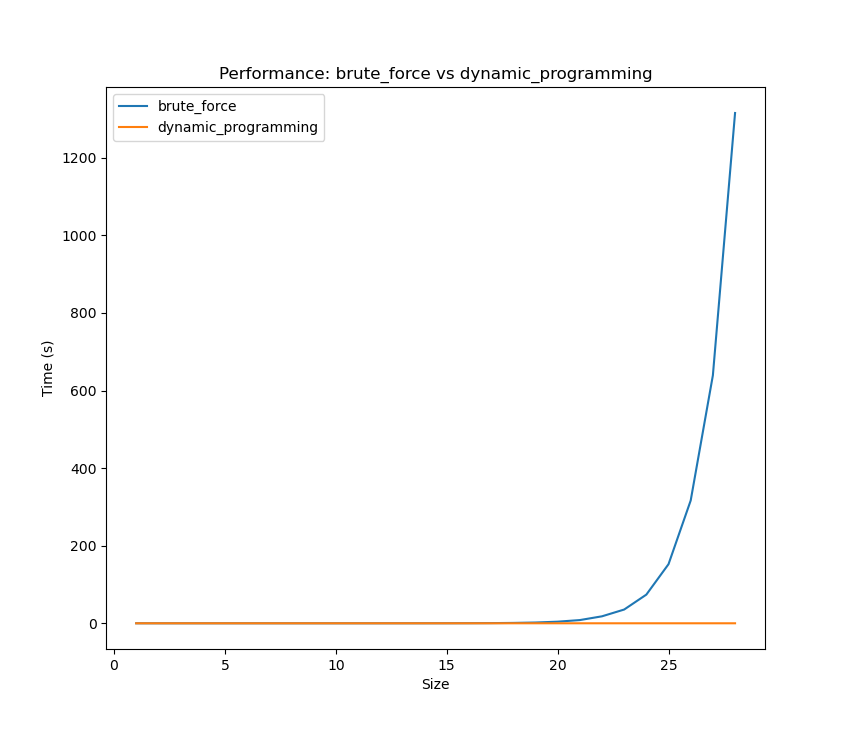
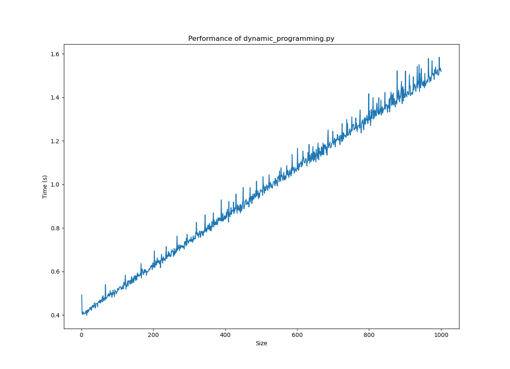

# Rendimiento

Estás son las especificaciones del equipo usado para realizar las ejecuciones:

* Procesador: 2x Intel Xeon Platinum 8168 (48 cores)
* Memoria RAM: 384 GB

Los resultados se truncan cuando el tamaño del problema (es decir, el número de vacas) es igual a 28 debido que la solución por 
fuerza bruta empieza a requerir más memoria de la disponible.

| Size | Brute Force | Dynamic Programming       |
|:------:|:-------------:|:---------------------:|
| 1    | 0.382       | 0.382                     |
| 2    | 0.358       | 0.366                     |
| 3    | 0.361       | 0.366               |
| 4    | 0.359       | 0.369               |
| 5    | 0.361       | 0.369               |
| 6    | 0.366       | 0.371               |
| 7    | 0.362       | 0.368               |
| 8    | 0.364       | 0.372               |
| 9    | 0.361       | 0.371               |
| 10   | 0.361       | 0.374               |
| 11   | 0.364       | 0.373               |
| 12   | 0.373       | 0.374               |
| 13   | 0.391       | 0.378               |
| 14   | 0.411       | 0.380               |
| 15   | 0.468       | 0.381               |
| 16   | 0.584       | 0.382               |
| 17   | 0.816       | 0.381               |
| 18   | 1.331       | 0.383               |
| 19   | 2.355       | 0.387               |
| 20   | 4.518       | 0.385               |
| 21   | 8.649       | 0.384               |
| 22   | 18.334      | 0.389               |
| 23   | 35.791      | 0.385               |
| 24   | 74.227      | 0.392               |
| 25   | 152.647     | 0.389               |
| 26   | 316.684     | 0.389               |
| 27   | 639.049     | 0.393               |
| 28   | 1314.929    | 0.396               |

Esta es la visualización gráfica de los resultados:

Como podemos observar la solución utilizando programación dinámica no varía en sus tiempos ejecución prácticamente en el rango en el que la solución por fuerza bruta explota exponencialmente.

En el caso de la solución por fuerza bruta el tiempo el tiempo de usuario empieza a ser sustancialmente mayor que el tiempo de
sistema a partir que el tamaño de problema es 17 o mayor. Aquí podemos observar que el tiempo se duplica cada vez que el
problema aumenta en una unidad. Esto va en consonancia con el hecho de que el problema escala como ``O(2^N)``. El uso de
memoria se incrementa en la misma proporción.

Para extraer más información del comportamiento de la solución programada con programación dinámica hemos realizado ejecuciones hasta un tamaño de problema de ``N=1000``, es decir, 1000 vacas. Este es el comportamiento:

Como se puede apreciar el tiempo de ejecución varía linealmente con el tamaño de problema.

## Relación de ficheros en este directorio

| Fichero                                             | Función                                | 
|-----------------------------------------------------|----------------------------------------------------------------------------------|
| [benchmark_executable.sh](benchmark_executable.sh)  | Lanza las ejecuciones hasta un tamaño de problema para los dos casos de estudio.  | 
| [plot.py](plot.py)                                  | Crea la gráfica que compara el rendimiento de las implementaciones.              |
| [plot_dynamic.py](plot_dynamic.py)                  | Crea la gráfica para ver el rendimiento de la solución con programación dinámica. |
| [performance.txt](performance.txt)                  | Datos con el tamaño de problema y tiempos de ejecución para los dos casos de estudio. |
| [dynamic_programming_performance.txt](dynamic_programming_performance.py) | Datos de las ejecuciones del programa dynamic_programming.py. |

